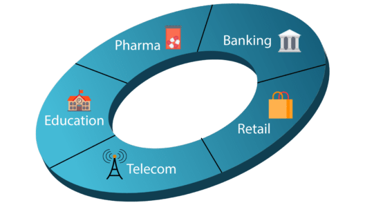

# R Tutorial : Why R and Who Uses R?

Why R?

- R is a programming and statistical language.
- R is used for data Analysis and Visualization.
- R is simple and easy to learn, read and write.
- R is an example of a Free and Open Source Software where one can freely distribute copies of this software, read it’s source code, modify it, etc.

Who uses R?

- The Consumer Financial Protection Bureau uses R for data analysis
- Statisticians at John Deere use R for time series modeling and geospatial analysis in a reliable and reproducible way.
- Bank of America uses R for reporting.
- R is part of technology stack behind Foursquare’s famed recommendation engine.
- ANZ, the fourth largest bank in Australia, using R for credit risk analysis.
- Google uses R to predict Economic Activity.
- Mozilla, the foundation responsible for the Firefox web browser, uses R to visualize Web activity.

Below are some of the domains where R is used:

