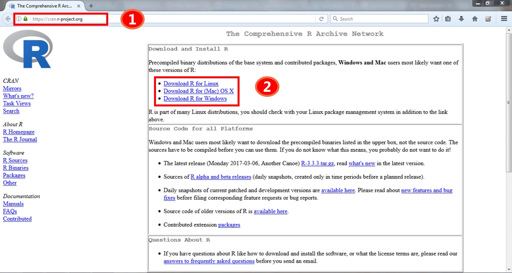
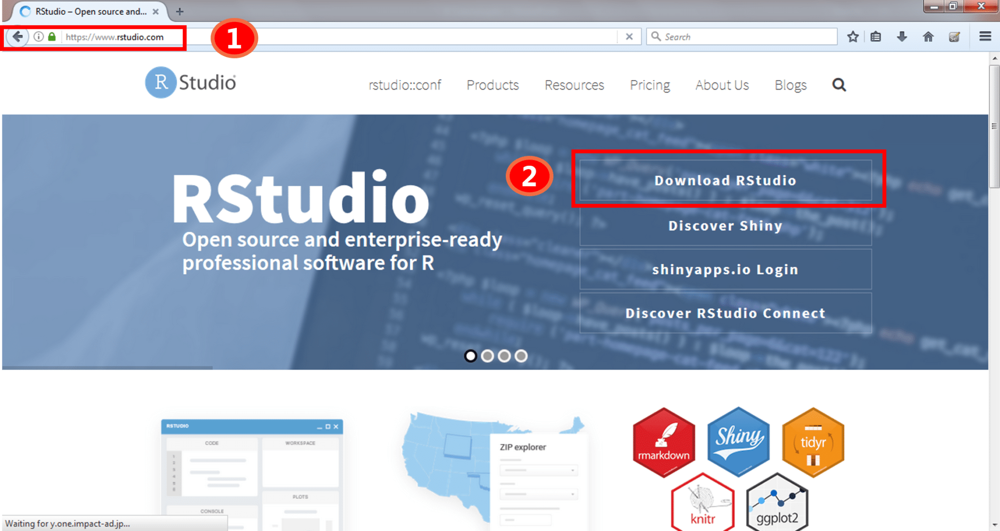
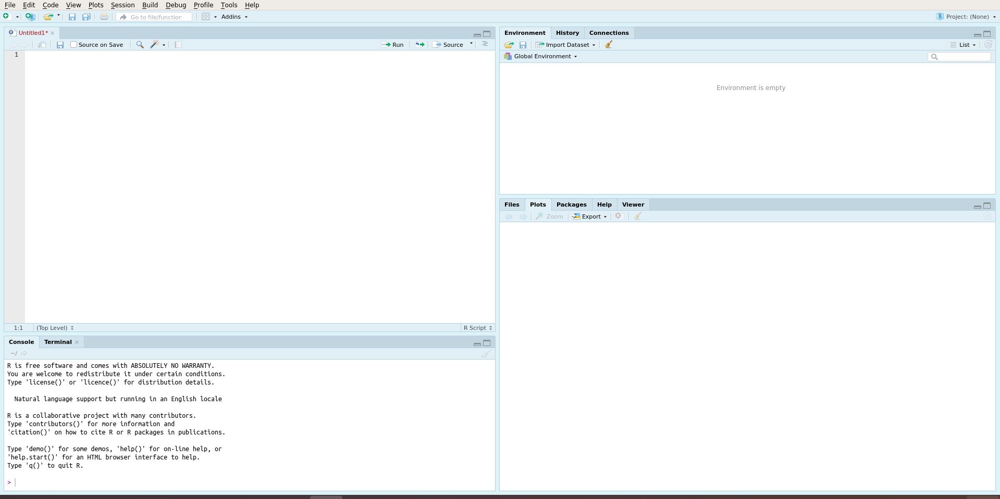

[Back](./readme.md)

# R Tutorial: Installation of R

In order to use R, we must first install two pieces of software:

- [**R-language:**](#installing-r) the actual software that runs the r programming language
- [**R-Studio:**](#installing-r-studio) an interface for interacting with the programming language

## Installing R 

Let me guide you through the process of installing R on your system. Just follow the below steps:

- **Step 1 :** Go to the link-  https://cran.r-project.org/
- **Step 2 :** Download and install R latests version on your system.

Refer to the below screenshot to get a better understanding.

## Installing R-Studio

By following the above steps, you are done with the R installation part. Now, you can directly start coding in R by downloading RStudio IDE. To download this, follow the below steps:   

- **Step 1 :** Go to the link- https://www.rstudio.com/
- **Step 2 :** Download  and install Rstudio on your system.

## Done
Once its all done you will should see this:

