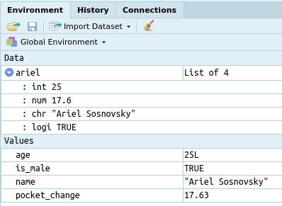
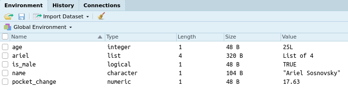
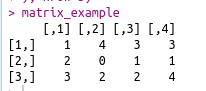
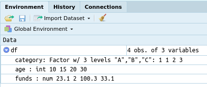
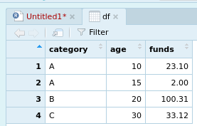

# Variables
In programming, a variable is a value that can change, depending on conditions or on information passed to the program.

A variable has five primary features:

1. **Name:** the reference for the variable
2. **Type:** the type of the variable (i.e. number, character etc)
3. **Length:** the amount of data a variable contains (measured in variable counts)
4. **Size:** the amount of memory a variable takes in memory (usually measured in bytes) 
4. **Value:** the actual data stored in the variable

## Dynamic Types
In R variables have "dynamic" types by default. This means that once you define a variable you can easily re-assign the same variable to store a differing type of data.

```r
a = 2
print(a)
a = "now a is a character"
print(a)
```

In R we many types that can be assigned to variables. In general, there are two kinds of types:

- **Primitive Types:** can only contain a singular value
- **List Types:** contain other variables

In this tutorial we will be focusing on the following:

### Primitive Types

- `Integers`
- `Numbers`
- `Characters`
- `Logical`
- `Factors`

### List Types

- `Vectors`
- `Matrices`
- `Data Frames`


## Examples

```r
age = 25L
pocket_change = 17.63
name = "Ariel Sosnovsky"
is_male = TRUE

ariel = list(age, pocket_change, name, is_male)
```




```r
matrix_example = matrix(c(
  1,2,3,4,
  0,2,3,1,
  2,3,1,4
), nrow=3)
```


```r
df = data.frame(
  category = factor(c("A","A","B","C")),
  age = c(10L,15L,20L,30L),
  funds = c(23.1, 2.0, 100.31, 33.12)
)
View(df)
```


