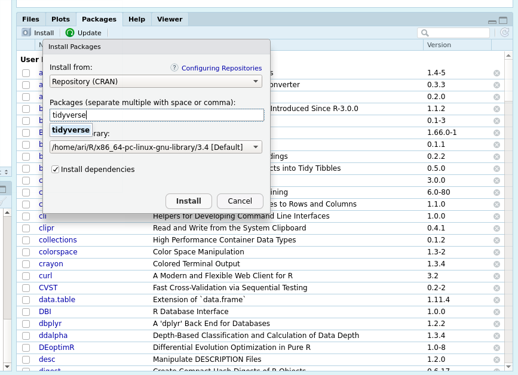

# Data Frames

## Introduction

A data frame is a table data-type in which each column contains values of one variable and each row contains one set of values from each column.

Following are the characteristics of a data frame.

- The column names should be non-empty.
- The row names should be unique.
- Each column should contain same number of data items.
- Each column contains data that has the same type.

The components of a data-frame are the following:

- Variables (Columns)
- Observations (Rows)
- Values (Cells)


## Tidyverse
The tidyverse is an opionionated collection of R packages designed for data analysis.

All packages share a "tidy" philosophy, ensuring that the code written is first-most easily readable and shares the same common APIs.

Install the required packages using the function below, or use R-Studio "Packages" tab on the bottom right.

```{r}
install.packages("tidyverse")
```



To start using tidyverse, either run the following command or enable it in the R-Studio "Packages" tab on the bottom right.
```r
require(tidyverse)
```


## Using Dataframes (basics)

Let's define some data-frame

```r
some_data = data_frame(
  names=c("Ari", "Tod", "Vita", "Fiona", "Shir"),
  gender=factor(c("male","male","female","female","female")),
  age=c(30,45,24,30,33),
  height=c(174,180,144,160,165)
)
```

Let's look at a subset of our data

```r
some_data %>% 
  filter(
    age > 30
  )
```

Let's look at an even more specific subset

```r
some_data %>% 
  filter(
    age > 30
  ) %>% 
  filter(
    gender == "male"
  )
```

Let's look at a subset of our data, but also only look at one given variable

```r
some_data %>% 
  filter(
    age > 30
  ) %>%
  select(names, gender)
```


Let's define some new variables

```r
some_data %>% 
  mutate(
    lower_case_names = tolower(names),
    normalized_age = (age-mean(age))/sd(age),
    normalized_height = (height-mean(height))/sd(height)
  )
```

Lets get some summary statistics on our age group

```r
some_data %>% 
  summarise(
    mean(age),
    min(age),
    max(age),
    var(age),
    sd(age),
    n()
  )
```

Let's create a simple "Pivot-Table"

```r
some_data %>% 
  group_by(
    gender
  ) %>% 
  summarise(
    mean(age),
    mean(height),
    n()
  )
```

Let's flatten our pivot-table

```r
some_data %>%
  group_by(
    gender
  ) %>%
  summarise(
    `Average Age`=mean(age),
    `Average Height`=mean(height),
    Count=n()
  ) %>% 
  gather(
    stat,
    value,
    -gender
  )
```

[Read here](https://dplyr.tidyverse.org/) for more about data mutation and filtering.