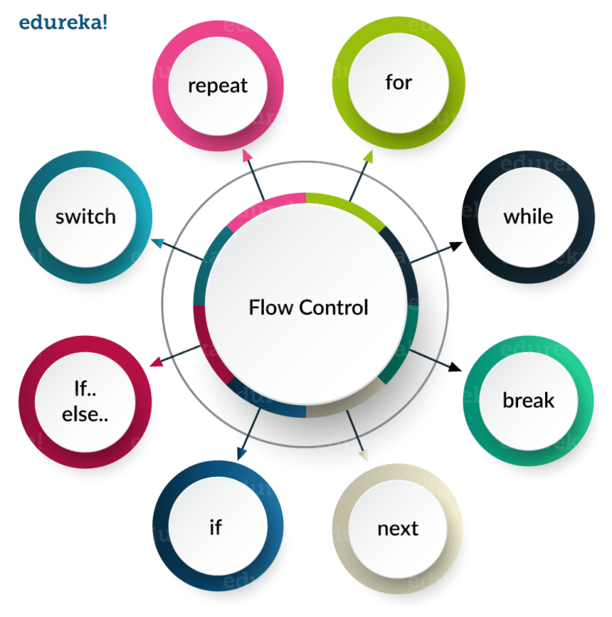
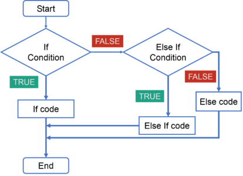
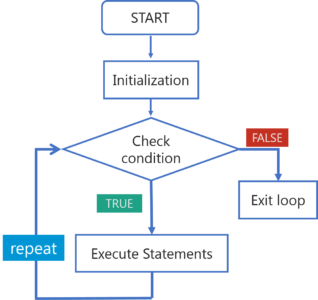

# Flow Control
Flow control statements play a very important role as they allow you to control the flow of execution of a script inside a function. The most commonly used flow control statements are represented in the below image:



For the purpose of this tutorial we will only focus on the "for" and "if" control flows.

## If control Statement 
This control statement evaluates a single condition. It is quite easy as it just has a single keyword “if” followed by the condition and then certain set of statements that needs to get executed in case it is true. Refer to the below flowchart to get a better understanding:



```r
age = 5

if (age > 25) {
  print("You may enter!")
}   else if(age > 15) {
  print("You may enter, but first pass a test!")
}   else {
  print("Forbidden Access")
}
```

## For-Loops
For loops are used when you need to execute a block of code several number of times. Refer to the below flowchart to get a better understanding: 



```r
for (num in c(1,2,3,4,5)) {
  print(c("the number is", num))
}
```

**Bonus**: make automatic sequences with the "colon" operator
```r
for (num in 1:5)) {
  print(c("the number is", num))
}
```
