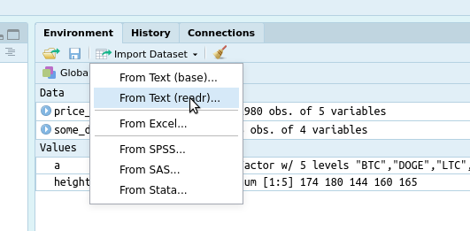

# Read Data

We can read in files in a variety of formats:

- csv: "Comma-Separated-Values"
- xlsx: "Excel Files"
- json: "Javascript Objects"
- xml: "XML Files"
- dbi: "Databases"

As well as any others (see [this link](https://www.tidyverse.org/packages/#import) if you are interested in more).

## Reading in Data

Read data from remote site

```r
price_data = read_csv("https://raw.githubusercontent.com/asosnovsky/R-Intro-Class/master/data/price_data.csv")
```

Read data locally

```r
price_data = read_csv("./price_data.csv")
```

Read data using the graphical interface.



