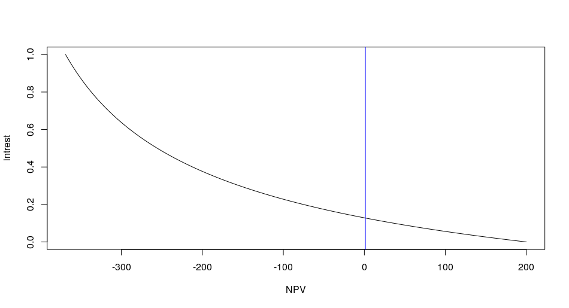

# Introduction
In this tutorial we will use Newtown's Method to calculate the Internal Rate of Return.

# Internal Rate of Return

Internal rate of return (IRR) is a metric used in capital budgeting to estimate the profitability of potential investments. Internal rate of return is a discount rate that makes the net present value (NPV) of all cash flows from a particular project equal to zero. IRR calculations rely on the same formula as NPV does.

The following is the formula for calculating NPV: 
$$
  NPV = \sum_{t=0}^n \frac{C_t}{(1+r)^t}
$$

The IRR would be the root of the NPV formula in terms of $r$. Essentially:

$$
  NPV(r=IRR) = 0
$$

# Newton's Method

This is a method for finding successively better approximations to the roots (or zeroes) of a real-valued function. It is one example of a root-finding algorithm. 

The method is described by the following:

Let $f$ be a differentiable function defined on the interval $(a, b)$ with values in the real numbers ℝ. T

Suppose we have an existing guess for its roots, $x_n$, we can use the initial guess and generate a better approximation for our roots, $x_{n+1}$ using the following theorem:
$$
  x_{n+1} = x_n - \frac{f(x_n)}{\frac{df(x_n)}{dx_n}}
$$

This idea is encompased in the following image:


# Implementation

## Net Present Value

In order to implement this method we would first need to write a function in R to compute the net present value. 

```r
NPV <- function(pmts, intrest) {

}
```

## Derivative of Net Present Value

The first deriviate of NPV is given by 

$$
  \frac{dNPV}{dr} = \sum_{t=1}^n -t\frac{C_t}{(1+r)^(t+1)}
$$
In R this can be written as the following function

```{r}
dNPV <- function(pmts, intrest) {

}
```

## Newtown's Method
Next will be writing Newtown's method in R. We will limit our iterations using the constants `MAX_ITERATIONS` and determine our breaking using the following condition:

$$
  |x_n-x_{n+1}| < \epsilon
$$

We can set our value of $\epsilon$ in the function using the `EPSILON` constant.

```{r}
IRR <- function(pmts, MAX_ITERATIONS = 1000, EPSILON = 1E-5) {
  
}
```

## Run The Method

The following will run our method:

```{r}
cashflows = c(-500, 100, 200, 100, 300)

print(IRR(cashflows))

```

# Evaluation

To ensure that we have done everything correctly. We will run it against some unit tests and we will plot the output of our work.

## Unit Tests

If you have done everything correctly, this should return TRUE.

```{r}
all(c(
  assertthat::are_equal(
    IRR(c(-500, 100, 200, 100, 300)), 
    0.1287, 
    tolerance=0.0001
  ),
  assertthat::are_equal(
    IRR(c(-100, 10, 20, 3)), 
    Inf, 
    tolerance=0.0001
  ),
  assertthat::are_equal(
    IRR(c(-100, 500, 500, 500)), 
    4.9766, 
    tolerance=0.0001
  )
))
```

## Plot: NPV vs Intrest

Replicate this plot



**hint**: look at `abline` for the straight lines.

```{r}
cashflows = c(-500, 100, 200, 100, 300)
irr = IRR(cashflows)

plot(
  ...
)
```


## 